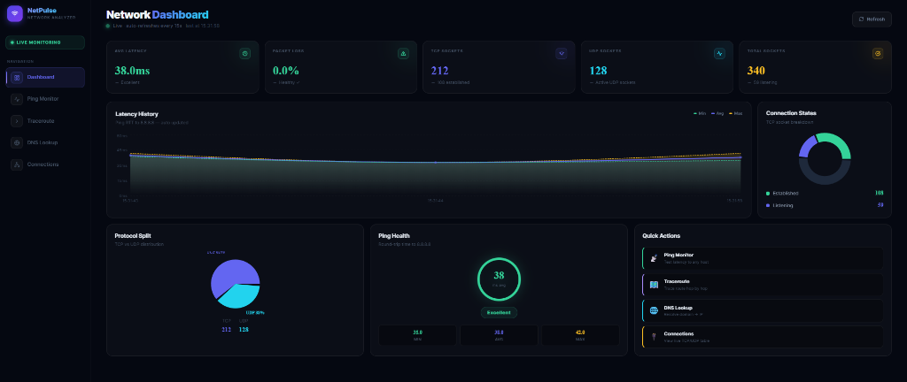

# ⚡ NetPulse — Real-Time Cyber Network Intelligence & Telemetry

[](https://reactjs.org/)
[](https://spring.io/projects/spring-boot)
[](https://openjdk.org/)
[](LICENSE)

**NetPulse** is a full-stack, real-time network intelligence and diagnostic platform designed with a modern cyber dark glassmorphism aesthetic. It bridges OS-level networking primitives (ICMP, raw sockets, route tables, DNS resolution) with an ultra-responsive web dashboard.

<p align="center">
  
</p>

---

## ✨ Features & Architecture

### 📊 1. Network Dashboard
- **Real-Time Telemetry**: Auto-refreshes latency and connection metrics every 15 seconds.
- **Latency History Timeline**: Multi-series area chart tracking Min, Avg, and Max RTT trends.
- **Socket Distribution Breakdown**: Interactive donut chart visualizing TCP vs UDP protocol splits and socket states.
- **Ping Health Gauge**: Radial rating meter indicating live network quality (LAN, Regional, Cross-Continent).

### 📡 2. Ping Monitor & ICMP Packet Inspector (RFC 792 / RFC 4443)
- **True RFC Packet Anatomy**: Disassembles every probe into exact ICMP header datagram fields:
  - **Request**: Type `8` (`128` IPv6), Code `0`, Sequence Number, 32-byte Payload, and 16-bit 1's complement Checksum.
  - **Reply**: Type `0` (`129` IPv6), Code `0`, Sequence Number, decremented IP TTL, and calculated Round-Trip Time (RTT).
- **Packet Transmission Pipeline**: Interactive lifecycle diagram tracing `Local NIC` $\to$ `DNS` $\to$ `Outbound Request` $\to$ `Transit Router TTL Decrement` $\to$ `Target NIC` $\to$ `Inbound Reply`.
- **Latency Quality Meter**: Visual rating bar benchmarked against LAN (<20ms), Edge (<60ms), and WAN thresholds.

### 🗺️ 3. Traceroute Visualizer & TTL Hop Mechanics Inspector
- **Interactive TTL Simulation**: Step-through visualizer showing how intermediate routers decrement the IP header TTL field (`TTL = 1, 2, ... N`).
- **RFC 792 Error Generation**: Explains why routers discard datagrams at `TTL=0` and return an **ICMP Type 11 (Time Exceeded)** packet to discover the network topology.
- **Destination Verification**: Identifies the terminal hop where the target host returns an **ICMP Type 0 (Echo Reply)**.
- **Multi-Probe Diagnostics**: Measures 3 probe round-trip times per hop with timeout handling for silent routers.

### 🌐 4. DNS Analyzer
- **Dual-Stack Resolution**: Automatic breakdown of IPv4 (`A`) and IPv6 (`AAAA`) addresses.
- **CNAME & Timing**: Identifies canonical hostnames and benchmarks query resolution speeds in milliseconds.
- **One-Click Copy**: Instant clipboard copying for any resolved IP address.

### 🔌 5. Active Connections Inspector
- **OS Kernel Inspection**: Directly parses live TCP/UDP socket tables via `netstat -ano`.
- **Interactive Filtering**: Search by IP, Port, State, or PID; instant protocol tabs (`All`, `TCP`, `UDP`); and state filters (`ESTABLISHED`, `LISTENING`, `TIME_WAIT`).

---

## 🚀 Quick Start

### Prerequisites
- **Java 17+**
- **Node.js 18+** & `npm`
- **Maven** (or included Maven wrapper)

### 1. Start Backend (Spring Boot)
```bash
cd backened
mvn clean spring-boot:run
```
*Backend runs at `http://localhost:8080`.*

### 2. Start Frontend (React + Vite)
```bash
cd frontend
npm install
npm run dev
```
*Frontend runs at `http://localhost:5173`.*

---

## 📡 REST API Reference

| Method | Endpoint | Query Params | Description |
|---|---|---|---|
| `GET` | `/api/ping` | `host`, `count` | Runs ICMP ping against target host |
| `GET` | `/api/traceroute` | `host`, `maxHops` | Traces route hops to destination |
| `GET` | `/api/dns` | `host` | Resolves IPv4/IPv6 and canonical name |
| `GET` | `/api/connections` | `protocol`, `limit` | Returns live OS socket table |
| `GET` | `/api/connections/summary` | — | Socket counts, states, and protocol aggregates |

---

## 🎨 Design System
- **Theme**: Cyber Dark Glassmorphism
- **Typography**: Inter (UI) & JetBrains Mono (Telemetry/Metrics)
- **Charts**: Recharts with customized linear gradients and tooltips
- **Icons**: Lucide React

---

## 📄 License
This project is licensed under the MIT License.
